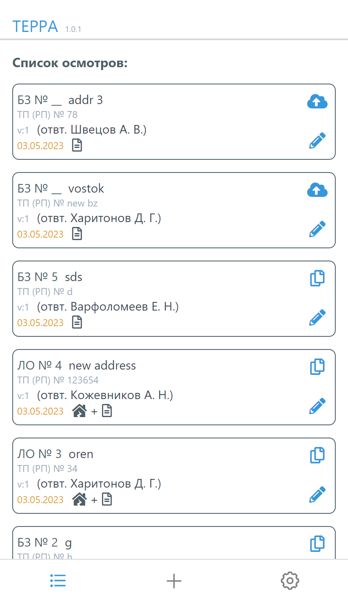
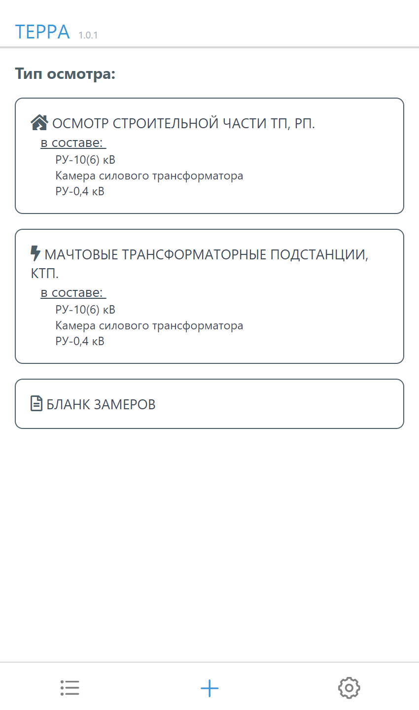
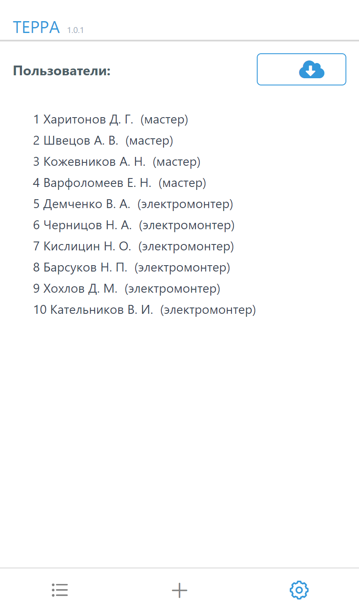
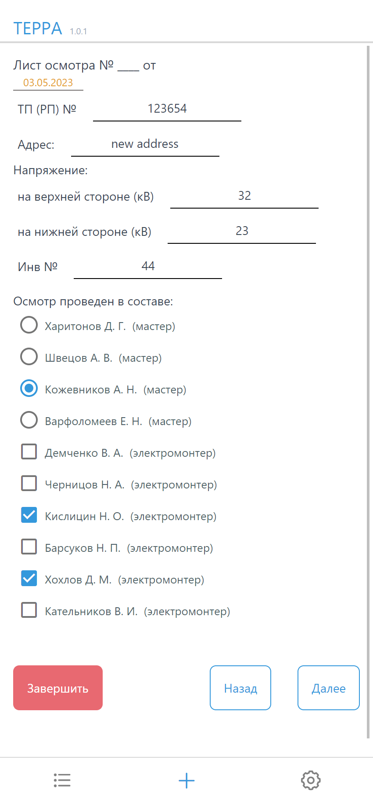
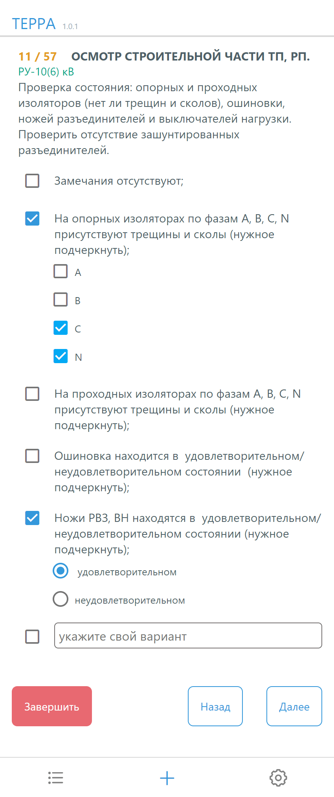
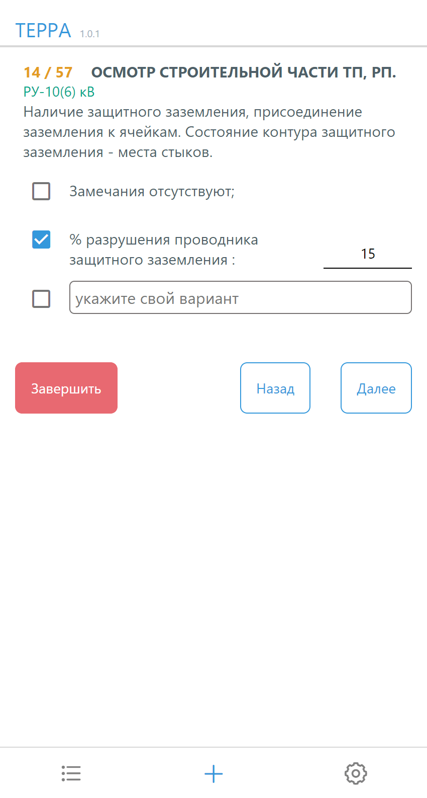
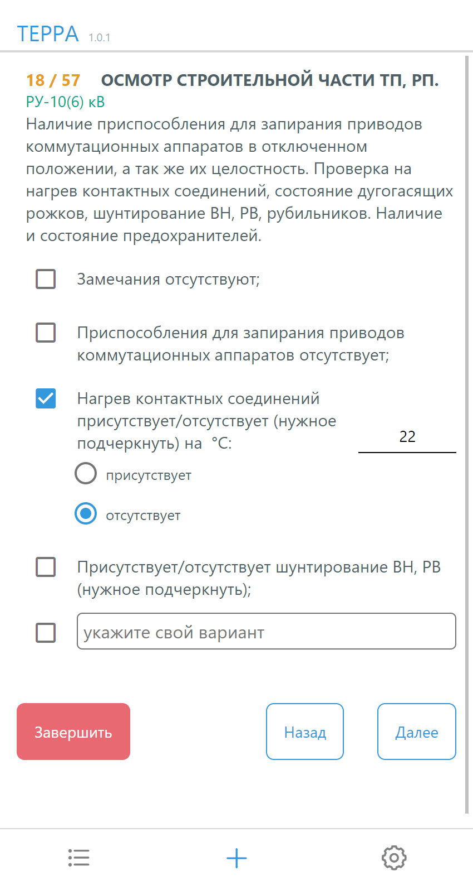
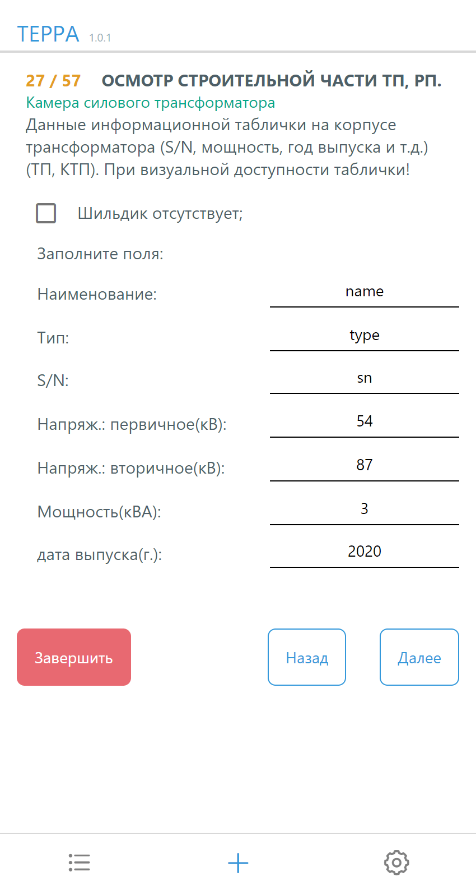
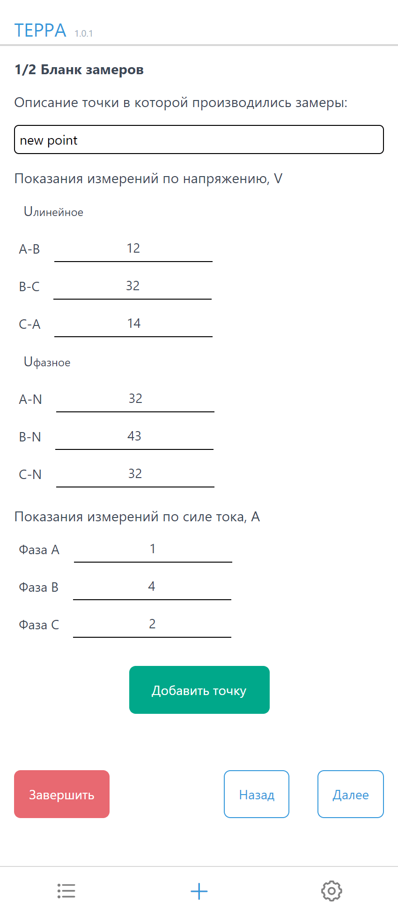

## build apk android

```sh
eas build -p android --profile preview
```
# terraApp
### - мобильное приложение под андроид на react native (expo). Сервер для этого приложения:  [terraServer](https://github.com/dsa25/terraServer)
#### Приложение для сбора данных и состояния объектов ТП, РП -)

Покликать приложение можно тут: [terraApp](https://terraapp.dsa25.ru)

#### Stack:
- react native
- expo
- React Native Async Storage - для хранения осмотров на телефоне, где нет интернета
</br>

#### Screenshots:

<table>
  <tr>
    <td>
    Список осмотров
    <ul>
      <li>отправка данных осмотра на сервер,</li>
      <li>редактирование осмотра, </li>
      <li>получить ссылку данного осмотра на сервере</li>
     </ul>
    </td>
    <td align="center"></td>
  </tr>
  <tr>
     <td>Добавление нового осмотра, пользователи</td>
     <td align="center">
       
      
     </td>
  </tr>
  <tr>
     <td>Вопросы с различными типами ответов. Бланк замеров</td>
     <td align="center">
      
      
      
      
      
      
     </td>
  </tr>
</table>
